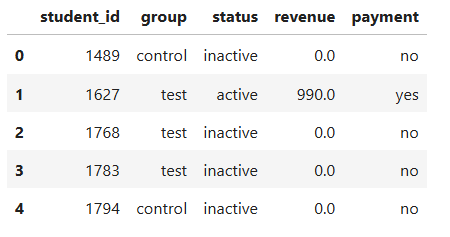
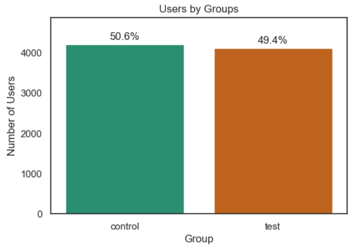
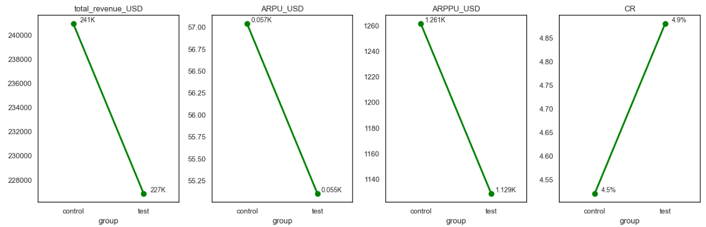
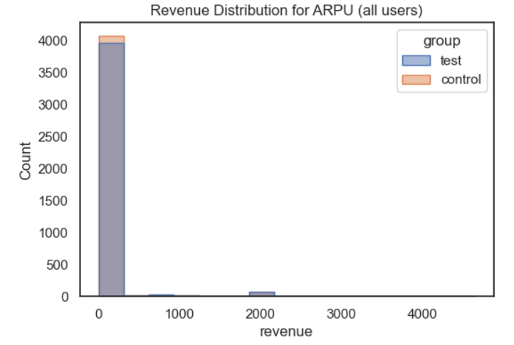
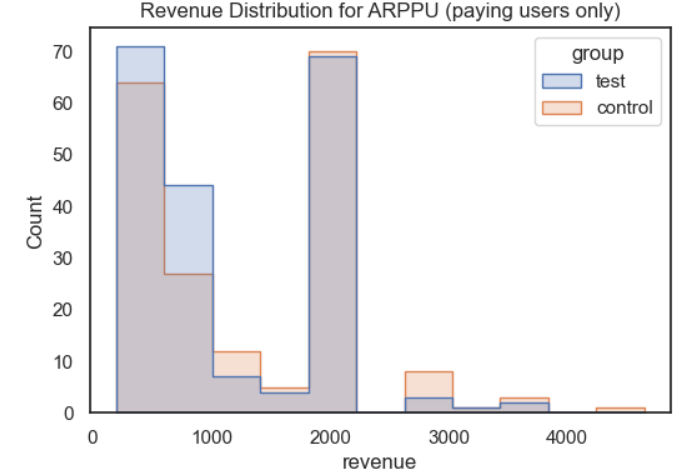
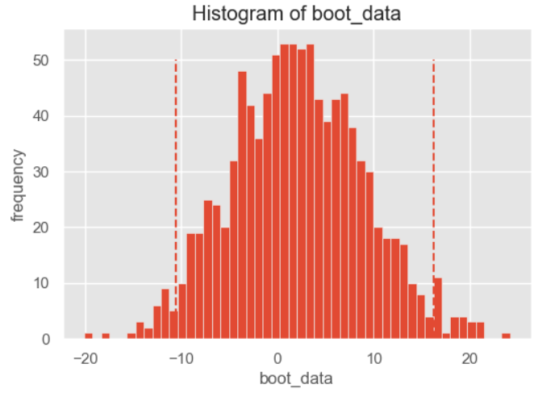
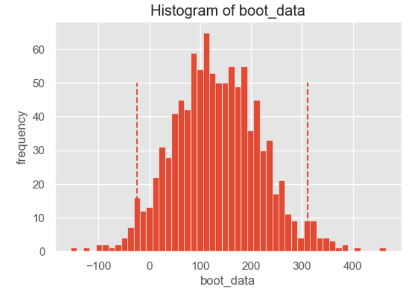

# EdTech Payment A/B Testing

###   
*Click above to view the complete data analysis with visualizations and insight*

### 🎯 Objective:
* In this mini-project, we analyze the impact of a new payment mechanism introduced on an online educational platform that offers courses and learning services to students.
* Our aim is to evaluate the effectiveness of a new payment mechanism compared to the existing baseline, investigate statistical significance of observed differences, and provide data-driven recommendations for business implementation.  

### 📊 Dataset:
**Source:** Educational platform experiment data  
**Key variables:** student_id, revenue   
**Aggregated DataFrame for Analysis**
  

### 🛠️ Technologies Used:
Libraries: pandas, numpy, seaborn, matplotlib, scipy.stats, tqdm  

### 📁 Repository Structure:
1. edtech-payment-ab-test.ipynb - working file  
2. users.csv - datasets - user devided into control(A) and test(B) groups  
4. logs.csv - dataset - platform login activity during experiment period  
5. payments.csv - dataset - payment transactions of users    

### 🔍 Analysis Process:  
* Conducted preliminary analysis (EDA) and data preprocessing  
* Analyzed the combined dataset to identify patterns in user activity, payments, and overall behavior during the experiment  
* Prepared Data for Testing and Analyzed the split between control and test groups (to ensure that users are evenly distributed)  
* Formulated Business Hypothesis   
* Сalculated Matrics  
* Statistical Testing of CR/ARPU/ARPPU  

### 💡 Key Findings:
* The project aimed to evaluate the impact of a new payment mechanism on user behavior and revenue generation. The total user base consisted of 74,576 users. For testing purposes, inactive users were excluded, leaving 8,341 active users (including 392 paying users and 7,949 non-paying users). These active users were randomly split into control and test groups with an approximately 50/50 distribution.  
* The effectiveness of the new payment mechanism will be analyzed using the following metrics: CR, ARPU, ARPPU.  
* Based on preliminary observations of metrics, we discovered that CR increased slightly in the test group (4.9% vs 4.5% in the control group) while ARPU and ARPPU were slightly lower in the test group (ARPU: USD 55 vs USD 57; ARPPU: USD 1,129 vs USD 1,261). Total revenue in the test group was marginally lower than in the control group.  
* Due to the skewed revenue distribution and presence of outliers, non-parametric methods such as bootstrap analysis were used to compare ARPU and ARPPU. Results showed no statistically significant differences between the control and test groups. Similarly, a Chi-square test for conversion rate yielded a p-value of 0.468, indicating no significant effect of the new payment mechanism.  
* Based on the statistical tests conducted (Chi-square for CR and bootstrap for ARPU/ARPPU), H₀ (that there is no difference between the new payment mechanism (test group) and the old one (control group)) cannot be rejected, indicating that the new payment mechanism does not significantly change user payment behavior or revenue.  

### 📈 Visualizations: 
  
  

  
  
  

### 📌 Project Notes:
***This is an educational project for learning data analysis and visualization techniques.***

